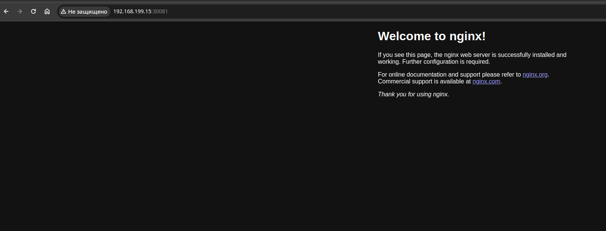
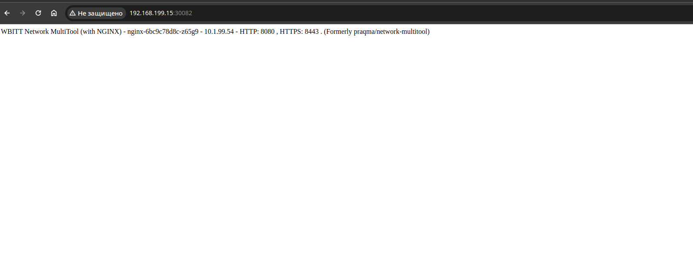

# Домашнее задание к занятию «Сетевое взаимодействие в K8S. Часть 1»

### Цель задания

В тестовой среде Kubernetes необходимо обеспечить доступ к приложению, установленному в предыдущем ДЗ и состоящему из двух контейнеров, по разным портам в разные контейнеры как внутри кластера, так и снаружи.

------

### Чеклист готовности к домашнему заданию

1. Установленное k8s-решение (например, MicroK8S).
2. Установленный локальный kubectl.
3. Редактор YAML-файлов с подключённым Git-репозиторием.

------

### Инструменты и дополнительные материалы, которые пригодятся для выполнения задания

1. [Описание](https://kubernetes.io/docs/concepts/workloads/controllers/deployment/) Deployment и примеры манифестов.
2. [Описание](https://kubernetes.io/docs/concepts/services-networking/service/) Описание Service.
3. [Описание](https://github.com/wbitt/Network-MultiTool) Multitool.

------

### Задание 1. Создать Deployment и обеспечить доступ к контейнерам приложения по разным портам из другого Pod внутри кластера

1. Создать Deployment приложения, состоящего из двух контейнеров (nginx и multitool), с количеством реплик 3 шт.
2. Создать Service, который обеспечит доступ внутри кластера до контейнеров приложения из п.1 по порту 9001 — nginx 80, по 9002 — multitool 8080.
3. Создать отдельный Pod с приложением multitool и убедиться с помощью `curl`, что из пода есть доступ до приложения из п.1 по разным портам в разные контейнеры.
4. Продемонстрировать доступ с помощью `curl` по доменному имени сервиса.
5. Предоставить манифесты Deployment и Service в решении, а также скриншоты или вывод команды п.4.

------

### Задание 2. Создать Service и обеспечить доступ к приложениям снаружи кластера

1. Создать отдельный Service приложения из Задания 1 с возможностью доступа снаружи кластера к nginx, используя тип NodePort.
2. Продемонстрировать доступ с помощью браузера или `curl` с локального компьютера.
3. Предоставить манифест и Service в решении, а также скриншоты или вывод команды п.2.


## Ответ

## Задача 1:
[deployment](files/deployment.yaml)

[service](files/service.yaml)

[multitool](files/multitool.yaml)

```sh
    ~/Д/ar/devops-netology/k/1.4/files$ kubectl get all                                           
NAME                         READY   STATUS    RESTARTS   AGE
pod/nginx-6bc9c78d8c-zpgbk   2/2     Running   0          12s
pod/nginx-6bc9c78d8c-g6wz8   2/2     Running   0          12s
pod/nginx-6bc9c78d8c-z65g9   2/2     Running   0          13s
pod/multitool                1/1     Running   0          3s

NAME                 TYPE        CLUSTER-IP       EXTERNAL-IP   PORT(S)             AGE
service/kubernetes   ClusterIP   10.152.183.1     <none>        443/TCP             15m
service/svcnginx     ClusterIP   10.152.183.243   <none>        9001/TCP,9002/TCP   8s

NAME                    READY   UP-TO-DATE   AVAILABLE   AGE
deployment.apps/nginx   3/3     3            3           13s

NAME                               DESIRED   CURRENT   READY   AGE
replicaset.apps/nginx-6bc9c78d8c   3         3         3       13s
    ~/Д/ar/devops-netology/k/1.4/files$ kubectl exec multitool -- curl -s svcnginx:9001           
<!DOCTYPE html>
<html>
<head>
<title>Welcome to nginx!</title>
<style>
html { color-scheme: light dark; }
body { width: 35em; margin: 0 auto;
font-family: Tahoma, Verdana, Arial, sans-serif; }
</style>
</head>
<body>
<h1>Welcome to nginx!</h1>
<p>If you see this page, the nginx web server is successfully installed and
working. Further configuration is required.</p>

<p>For online documentation and support please refer to
<a href="http://nginx.org/">nginx.org</a>.<br/>
Commercial support is available at
<a href="http://nginx.com/">nginx.com</a>.</p>

<p><em>Thank you for using nginx.</em></p>
</body>
</html>
    ~/Д/ar/devops-netology/k/1.4/files$ kubectl exec multitool -- curl -s svcnginx:9002           
WBITT Network MultiTool (with NGINX) - nginx-6bc9c78d8c-zpgbk - 10.1.99.53 - HTTP: 8080 , HTTPS: 8443 . (Formerly praqma/network-multitool)

```

## Задача 2:

[NodePort](files/svcNodePort.yaml)




------

### Правила приёма работы

1. Домашняя работа оформляется в своем Git-репозитории в файле README.md. Выполненное домашнее задание пришлите ссылкой на .md-файл в вашем репозитории.
2. Файл README.md должен содержать скриншоты вывода необходимых команд `kubectl` и скриншоты результатов.
3. Репозиторий должен содержать тексты манифестов или ссылки на них в файле README.md.

