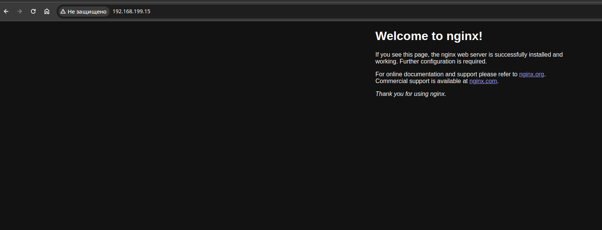
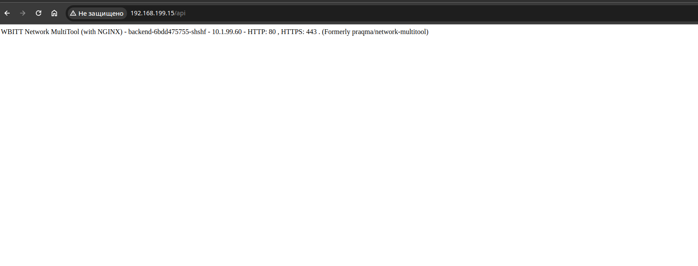

# Домашнее задание к занятию «Сетевое взаимодействие в K8S. Часть 2»

### Цель задания

В тестовой среде Kubernetes необходимо обеспечить доступ к двум приложениям снаружи кластера по разным путям.

------

### Чеклист готовности к домашнему заданию

1. Установленное k8s-решение (например, MicroK8S).
2. Установленный локальный kubectl.
3. Редактор YAML-файлов с подключённым Git-репозиторием.

------

### Инструменты и дополнительные материалы, которые пригодятся для выполнения задания

1. [Инструкция](https://microk8s.io/docs/getting-started) по установке MicroK8S.
2. [Описание](https://kubernetes.io/docs/concepts/services-networking/service/) Service.
3. [Описание](https://kubernetes.io/docs/concepts/services-networking/ingress/) Ingress.
4. [Описание](https://github.com/wbitt/Network-MultiTool) Multitool.

------

### Задание 1. Создать Deployment приложений backend и frontend

1. Создать Deployment приложения _frontend_ из образа nginx с количеством реплик 3 шт.
2. Создать Deployment приложения _backend_ из образа multitool. 
3. Добавить Service, которые обеспечат доступ к обоим приложениям внутри кластера. 
4. Продемонстрировать, что приложения видят друг друга с помощью Service.
5. Предоставить манифесты Deployment и Service в решении, а также скриншоты или вывод команды п.4.

------

### Задание 2. Создать Ingress и обеспечить доступ к приложениям снаружи кластера

1. Включить Ingress-controller в MicroK8S.
2. Создать Ingress, обеспечивающий доступ снаружи по IP-адресу кластера MicroK8S так, чтобы при запросе только по адресу открывался _frontend_ а при добавлении /api - _backend_.
3. Продемонстрировать доступ с помощью браузера или `curl` с локального компьютера.
4. Предоставить манифесты и скриншоты или вывод команды п.2.

## Ответ

## Задача 1:

[frontend](files/frontend.yaml)

[backend](files/backend.yaml)

[svcfrontend](files/svcfrontend.yaml)

[svcbackend](files/svcbackend.yaml)

```sh
    ~/Д/ar/devops-netology/k/1.5/files$ kubectl get all   
NAME                           READY   STATUS    RESTARTS   AGE
pod/frontend-bf9df44d6-v4czl   1/1     Running   0          23s
pod/frontend-bf9df44d6-9l6s6   1/1     Running   0          23s
pod/frontend-bf9df44d6-4zpnn   1/1     Running   0          23s
pod/backend-6bdd475755-shshf   1/1     Running   0          18s

NAME                  TYPE        CLUSTER-IP       EXTERNAL-IP   PORT(S)   AGE
service/kubernetes    ClusterIP   10.152.183.1     <none>        443/TCP   36m
service/svcfrontend   ClusterIP   10.152.183.154   <none>        80/TCP    8s
service/svcbackend    ClusterIP   10.152.183.51    <none>        80/TCP    3s

NAME                       READY   UP-TO-DATE   AVAILABLE   AGE
deployment.apps/frontend   3/3     3            3           23s
deployment.apps/backend    1/1     1            1           18s

NAME                                 DESIRED   CURRENT   READY   AGE
replicaset.apps/frontend-bf9df44d6   3         3         3       23s
replicaset.apps/backend-6bdd475755   1         1         1       18s
    ~/Д/ar/devops-netology/k/1.5/files$ kubectl exec frontend-bf9df44d6-v4czl -- curl -s svcbackend      
WBITT Network MultiTool (with NGINX) - backend-6bdd475755-shshf - 10.1.99.60 - HTTP: 80 , HTTPS: 443 . (Formerly praqma/network-multitool)
    ~/Д/ar/devops-netology/k/1.5/files$ kubectl exec backend-6bdd475755-shshf -- curl -s svcfrontend      
<!DOCTYPE html>
<html>
<head>
<title>Welcome to nginx!</title>
<style>
html { color-scheme: light dark; }
body { width: 35em; margin: 0 auto;
font-family: Tahoma, Verdana, Arial, sans-serif; }
</style>
</head>
<body>
<h1>Welcome to nginx!</h1>
<p>If you see this page, the nginx web server is successfully installed and
working. Further configuration is required.</p>

<p>For online documentation and support please refer to
<a href="http://nginx.org/">nginx.org</a>.<br/>
Commercial support is available at
<a href="http://nginx.com/">nginx.com</a>.</p>

<p><em>Thank you for using nginx.</em></p>
</body>
</html>
```

## Задача 2:
[ingress](files/ingress.yaml)

```sh
    ~/Д/ar/devops-netology/k/1.5/files$ kubectl get ingress
NAME    CLASS   HOSTS   ADDRESS     PORTS   AGE
nginx   nginx   *       127.0.0.1   80      4m22s
```




------

### Правила приема работы

1. Домашняя работа оформляется в своем Git-репозитории в файле README.md. Выполненное домашнее задание пришлите ссылкой на .md-файл в вашем репозитории.
2. Файл README.md должен содержать скриншоты вывода необходимых команд `kubectl` и скриншоты результатов.
3. Репозиторий должен содержать тексты манифестов или ссылки на них в файле README.md.

------
