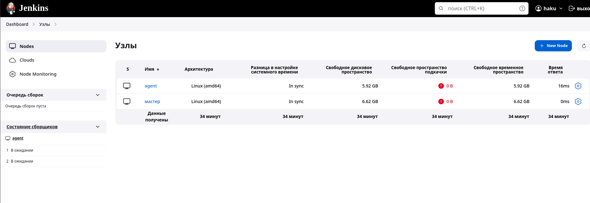

# Домашнее задание к занятию 10 «Jenkins»

## Подготовка к выполнению

1. Создать два VM: для jenkins-master и jenkins-agent.
2. Установить Jenkins при помощи playbook.
3. Запустить и проверить работоспособность.
4. Сделать первоначальную настройку.

## Основная часть

1. Сделать Freestyle Job, который будет запускать `molecule test` из любого вашего репозитория с ролью.
2. Сделать Declarative Pipeline Job, который будет запускать `molecule test` из любого вашего репозитория с ролью.
3. Перенести Declarative Pipeline в репозиторий в файл `Jenkinsfile`.
4. Создать Multibranch Pipeline на запуск `Jenkinsfile` из репозитория.
5. Создать Scripted Pipeline, наполнить его скриптом из [pipeline](./pipeline).
6. Внести необходимые изменения, чтобы Pipeline запускал `ansible-playbook` без флагов `--check --diff`, если не установлен параметр при запуске джобы (prod_run = True). По умолчанию параметр имеет значение False и запускает прогон с флагами `--check --diff`.
7. Проверить работоспособность, исправить ошибки, исправленный Pipeline вложить в репозиторий в файл `ScriptedJenkinsfile`.
8. Отправить ссылку на репозиторий с ролью и Declarative Pipeline и Scripted Pipeline.

### Ответ



```sh
Started by user haku
Running as SYSTEM
Building remotely on agent in workspace /opt/jenkins_agent/workspace/freestyle
[WS-CLEANUP] Deleting project workspace...
[WS-CLEANUP] Deferred wipeout is used...
[WS-CLEANUP] Done
The recommended git tool is: NONE
using credential 2125faaf-b0d9-4446-916a-5170bec0f10e
Cloning the remote Git repository
Cloning repository git@github.com:ardeun/vector-role.git
 > git init /opt/jenkins_agent/workspace/freestyle # timeout=10
Fetching upstream changes from git@github.com:ardeun/vector-role.git
 > git --version # timeout=10
 > git --version # 'git version 1.8.3.1'
using GIT_SSH to set credentials 
[INFO] Currently running in a labeled security context
[INFO] Currently SELinux is 'enforcing' on the host
 > /usr/bin/chcon --type=ssh_home_t /opt/jenkins_agent/workspace/freestyle@tmp/jenkins-gitclient-ssh11151184246105832281.key
Verifying host key using known hosts file
 > git fetch --tags --progress git@github.com:ardeun/vector-role.git +refs/heads/*:refs/remotes/origin/* # timeout=10
 > git config remote.origin.url git@github.com:ardeun/vector-role.git # timeout=10
 > git config --add remote.origin.fetch +refs/heads/*:refs/remotes/origin/* # timeout=10
Avoid second fetch
 > git rev-parse refs/remotes/origin/main^{commit} # timeout=10
Checking out Revision 5d9c3dea271942aa4fbe0275b1ebf54721346079 (refs/remotes/origin/main)
 > git config core.sparsecheckout # timeout=10
 > git checkout -f 5d9c3dea271942aa4fbe0275b1ebf54721346079 # timeout=10
Commit message: "08-ansible-05-testing tox"
 > git rev-list --no-walk 5d9c3dea271942aa4fbe0275b1ebf54721346079 # timeout=10
[freestyle] $ /bin/sh -xe /tmp/jenkins4449832976891604874.sh
+ pip3 install --user molecule==3.5.2 molecule_docker ansible-lint yamllint
Requirement already satisfied: molecule==3.5.2 in /home/haku/.local/lib/python3.6/site-packages (3.5.2)
Requirement already satisfied: molecule_docker in /home/haku/.local/lib/python3.6/site-packages (1.1.0)
Requirement already satisfied: ansible-lint in /home/haku/.local/lib/python3.6/site-packages (5.4.0)
Requirement already satisfied: yamllint in /home/haku/.local/lib/python3.6/site-packages (1.28.0)
Requirement already satisfied: selinux in /usr/local/lib/python3.6/site-packages (from molecule==3.5.2) (0.2.1)
Requirement already satisfied: enrich>=1.2.5 in /home/haku/.local/lib/python3.6/site-packages (from molecule==3.5.2) (1.2.7)
Requirement already satisfied: rich>=9.5.1 in /home/haku/.local/lib/python3.6/site-packages (from molecule==3.5.2) (12.6.0)
Requirement already satisfied: PyYAML<6,>=5.1 in /home/haku/.local/lib/python3.6/site-packages (from molecule==3.5.2) (5.4.1)
Requirement already satisfied: cerberus!=1.3.3,!=1.3.4,>=1.3.1 in /home/haku/.local/lib/python3.6/site-packages (from molecule==3.5.2) (1.3.5)
Requirement already satisfied: dataclasses in /home/haku/.local/lib/python3.6/site-packages (from molecule==3.5.2) (0.8)
Requirement already satisfied: cookiecutter>=1.7.3 in /home/haku/.local/lib/python3.6/site-packages (from molecule==3.5.2) (1.7.3)
Requirement already satisfied: click-help-colors>=0.9 in /home/haku/.local/lib/python3.6/site-packages (from molecule==3.5.2) (0.9.2)
Requirement already satisfied: ansible-compat>=0.5.0 in /home/haku/.local/lib/python3.6/site-packages (from molecule==3.5.2) (1.0.0)
Requirement already satisfied: packaging in /usr/local/lib/python3.6/site-packages (from molecule==3.5.2) (21.3)
Requirement already satisfied: pluggy<2.0,>=0.7.1 in /home/haku/.local/lib/python3.6/site-packages (from molecule==3.5.2) (1.0.0)
Requirement already satisfied: importlib-metadata in /home/haku/.local/lib/python3.6/site-packages (from molecule==3.5.2) (4.8.3)
Requirement already satisfied: paramiko<3,>=2.5.0 in /home/haku/.local/lib/python3.6/site-packages (from molecule==3.5.2) (2.12.0)
Requirement already satisfied: subprocess-tee>=0.3.5 in /home/haku/.local/lib/python3.6/site-packages (from molecule==3.5.2) (0.3.5)
Requirement already satisfied: Jinja2>=2.11.3 in /usr/local/lib/python3.6/site-packages (from molecule==3.5.2) (3.0.3)
Requirement already satisfied: click<9,>=8.0 in /home/haku/.local/lib/python3.6/site-packages (from molecule==3.5.2) (8.0.4)
Requirement already satisfied: docker>=4.3.1 in /home/haku/.local/lib/python3.6/site-packages (from molecule_docker) (5.0.3)
Requirement already satisfied: requests in /home/haku/.local/lib/python3.6/site-packages (from molecule_docker) (2.27.1)
Requirement already satisfied: typing-extensions in /home/haku/.local/lib/python3.6/site-packages (from ansible-lint) (4.1.1)
Requirement already satisfied: wcmatch>=7.0 in /home/haku/.local/lib/python3.6/site-packages (from ansible-lint) (8.3)
Requirement already satisfied: tenacity in /home/haku/.local/lib/python3.6/site-packages (from ansible-lint) (8.2.2)
Requirement already satisfied: ruamel.yaml<1,>=0.15.34 in /home/haku/.local/lib/python3.6/site-packages (from ansible-lint) (0.17.35)
Requirement already satisfied: setuptools in /usr/local/lib/python3.6/site-packages (from yamllint) (59.6.0)
Requirement already satisfied: pathspec>=0.5.3 in /home/haku/.local/lib/python3.6/site-packages (from yamllint) (0.9.0)
Requirement already satisfied: cached-property~=1.5 in /home/haku/.local/lib/python3.6/site-packages (from ansible-compat>=0.5.0->molecule==3.5.2) (1.5.2)
Requirement already satisfied: python-slugify>=4.0.0 in /home/haku/.local/lib/python3.6/site-packages (from cookiecutter>=1.7.3->molecule==3.5.2) (6.1.2)
Requirement already satisfied: jinja2-time>=0.2.0 in /home/haku/.local/lib/python3.6/site-packages (from cookiecutter>=1.7.3->molecule==3.5.2) (0.2.0)
Requirement already satisfied: poyo>=0.5.0 in /home/haku/.local/lib/python3.6/site-packages (from cookiecutter>=1.7.3->molecule==3.5.2) (0.5.0)
Requirement already satisfied: binaryornot>=0.4.4 in /home/haku/.local/lib/python3.6/site-packages (from cookiecutter>=1.7.3->molecule==3.5.2) (0.4.4)
Requirement already satisfied: six>=1.10 in /home/haku/.local/lib/python3.6/site-packages (from cookiecutter>=1.7.3->molecule==3.5.2) (1.16.0)
Requirement already satisfied: websocket-client>=0.32.0 in /home/haku/.local/lib/python3.6/site-packages (from docker>=4.3.1->molecule_docker) (1.3.1)
Requirement already satisfied: MarkupSafe>=2.0 in /usr/local/lib64/python3.6/site-packages (from Jinja2>=2.11.3->molecule==3.5.2) (2.0.1)
Requirement already satisfied: pynacl>=1.0.1 in /home/haku/.local/lib/python3.6/site-packages (from paramiko<3,>=2.5.0->molecule==3.5.2) (1.5.0)
Requirement already satisfied: bcrypt>=3.1.3 in /home/haku/.local/lib/python3.6/site-packages (from paramiko<3,>=2.5.0->molecule==3.5.2) (4.0.1)
Requirement already satisfied: cryptography>=2.5 in /usr/local/lib64/python3.6/site-packages (from paramiko<3,>=2.5.0->molecule==3.5.2) (40.0.2)
Requirement already satisfied: zipp>=0.5 in /home/haku/.local/lib/python3.6/site-packages (from importlib-metadata->molecule==3.5.2) (3.6.0)
Requirement already satisfied: idna<4,>=2.5 in /home/haku/.local/lib/python3.6/site-packages (from requests->molecule_docker) (3.4)
Requirement already satisfied: charset-normalizer~=2.0.0 in /home/haku/.local/lib/python3.6/site-packages (from requests->molecule_docker) (2.0.12)
Requirement already satisfied: certifi>=2017.4.17 in /home/haku/.local/lib/python3.6/site-packages (from requests->molecule_docker) (2023.7.22)
Requirement already satisfied: urllib3<1.27,>=1.21.1 in /home/haku/.local/lib/python3.6/site-packages (from requests->molecule_docker) (1.26.18)
Requirement already satisfied: pygments<3.0.0,>=2.6.0 in /home/haku/.local/lib/python3.6/site-packages (from rich>=9.5.1->molecule==3.5.2) (2.14.0)
Requirement already satisfied: commonmark<0.10.0,>=0.9.0 in /home/haku/.local/lib/python3.6/site-packages (from rich>=9.5.1->molecule==3.5.2) (0.9.1)
Requirement already satisfied: ruamel.yaml.clib>=0.2.7 in /home/haku/.local/lib/python3.6/site-packages (from ruamel.yaml<1,>=0.15.34->ansible-lint) (0.2.8)
Requirement already satisfied: bracex>=2.1.1 in /home/haku/.local/lib/python3.6/site-packages (from wcmatch>=7.0->ansible-lint) (2.2.1)
Requirement already satisfied: pyparsing!=3.0.5,>=2.0.2 in /usr/local/lib/python3.6/site-packages (from packaging->molecule==3.5.2) (3.1.1)
Requirement already satisfied: distro>=1.3.0 in /usr/local/lib/python3.6/site-packages (from selinux->molecule==3.5.2) (1.8.0)
Requirement already satisfied: chardet>=3.0.2 in /home/haku/.local/lib/python3.6/site-packages (from binaryornot>=0.4.4->cookiecutter>=1.7.3->molecule==3.5.2) (5.0.0)
Requirement already satisfied: cffi>=1.12 in /usr/local/lib64/python3.6/site-packages (from cryptography>=2.5->paramiko<3,>=2.5.0->molecule==3.5.2) (1.15.1)
Requirement already satisfied: arrow in /home/haku/.local/lib/python3.6/site-packages (from jinja2-time>=0.2.0->cookiecutter>=1.7.3->molecule==3.5.2) (1.2.3)
Requirement already satisfied: text-unidecode>=1.3 in /home/haku/.local/lib/python3.6/site-packages (from python-slugify>=4.0.0->cookiecutter>=1.7.3->molecule==3.5.2) (1.3)
Requirement already satisfied: pycparser in /usr/local/lib/python3.6/site-packages (from cffi>=1.12->cryptography>=2.5->paramiko<3,>=2.5.0->molecule==3.5.2) (2.21)
Requirement already satisfied: python-dateutil>=2.7.0 in /home/haku/.local/lib/python3.6/site-packages (from arrow->jinja2-time>=0.2.0->cookiecutter>=1.7.3->molecule==3.5.2) (2.8.2)
+ molecule test
/home/haku/.local/lib/python3.6/site-packages/requests/__init__.py:104: RequestsDependencyWarning: urllib3 (1.26.18) or chardet (5.0.0)/charset_normalizer (2.0.12) doesn't match a supported version!
  RequestsDependencyWarning)
/usr/local/lib/python3.6/site-packages/ansible/parsing/vault/__init__.py:44: CryptographyDeprecationWarning: Python 3.6 is no longer supported by the Python core team. Therefore, support for it is deprecated in cryptography. The next release of cryptography will remove support for Python 3.6.
  from cryptography.exceptions import InvalidSignature
INFO     default scenario test matrix: dependency, lint, cleanup, destroy, syntax, create, prepare, converge, idempotence, side_effect, verify, cleanup, destroy
INFO     Performing prerun...
INFO     Set ANSIBLE_LIBRARY=/home/haku/.cache/ansible-compat/e90229/modules:/home/haku/.ansible/plugins/modules:/usr/share/ansible/plugins/modules
INFO     Set ANSIBLE_COLLECTIONS_PATH=/home/haku/.cache/ansible-compat/e90229/collections:/home/haku/.ansible/collections:/usr/share/ansible/collections
INFO     Set ANSIBLE_ROLES_PATH=/home/haku/.cache/ansible-compat/e90229/roles:/home/haku/.ansible/roles:/usr/share/ansible/roles:/etc/ansible/roles
INFO     Running default > dependency
WARNING  Skipping, missing the requirements file.
WARNING  Skipping, missing the requirements file.
INFO     Running default > lint
COMMAND: ansible-lint .
yamllint .

/usr/local/lib/python3.6/site-packages/ansible/parsing/vault/__init__.py:44: CryptographyDeprecationWarning: Python 3.6 is no longer supported by the Python core team. Therefore, support for it is deprecated in cryptography. The next release of cryptography will remove support for Python 3.6.
  from cryptography.exceptions import InvalidSignature
WARNING: PATH altered to include /usr/bin
WARNING  /usr/local/lib/python3.6/site-packages/ansible/parsing/vault/__init__.py:44: CryptographyDeprecationWarning: Python 3.6 is no longer supported by the Python core team. Therefore, support for it is deprecated in cryptography. The next release of cryptography will remove support for Python 3.6.
  from cryptography.exceptions import InvalidSignature

WARNING  Loading custom .yamllint config file, this extends our internal yamllint config.
INFO     Running default > cleanup
WARNING  Skipping, cleanup playbook not configured.
INFO     Running default > destroy
INFO     Sanity checks: 'docker'

PLAY [Destroy] *****************************************************************

TASK [Destroy molecule instance(s)] ********************************************
/usr/local/lib/python3.6/site-packages/ansible/parsing/vault/__init__.py:44: CryptographyDeprecationWarning: Python 3.6 is no longer supported by the Python core team. Therefore, support for it is deprecated in cryptography. The next release of cryptography will remove support for Python 3.6.
  from cryptography.exceptions import InvalidSignature
changed: [localhost] => (item=instance)
changed: [localhost] => (item=ubuntu)

TASK [Wait for instance(s) deletion to complete] *******************************
ok: [localhost] => (item=instance)
ok: [localhost] => (item=ubuntu)

TASK [Delete docker networks(s)] ***********************************************

PLAY RECAP *********************************************************************
localhost                  : ok=2    changed=1    unreachable=0    failed=0    skipped=1    rescued=0    ignored=0

INFO     Running default > syntax

playbook: /opt/jenkins_agent/workspace/freestyle/molecule/default/converge.yml
/usr/local/lib/python3.6/site-packages/ansible/parsing/vault/__init__.py:44: CryptographyDeprecationWarning: Python 3.6 is no longer supported by the Python core team. Therefore, support for it is deprecated in cryptography. The next release of cryptography will remove support for Python 3.6.
  from cryptography.exceptions import InvalidSignature
INFO     Running default > create

PLAY [Create] ******************************************************************

TASK [Log into a Docker registry] **********************************************
/usr/local/lib/python3.6/site-packages/ansible/parsing/vault/__init__.py:44: CryptographyDeprecationWarning: Python 3.6 is no longer supported by the Python core team. Therefore, support for it is deprecated in cryptography. The next release of cryptography will remove support for Python 3.6.
  from cryptography.exceptions import InvalidSignature
skipping: [localhost] => (item=None)
skipping: [localhost] => (item=None)
skipping: [localhost]

TASK [Check presence of custom Dockerfiles] ************************************
ok: [localhost] => (item={'image': 'docker.io/aragast/netology:latest', 'name': 'instance', 'pre_build_image': True})
ok: [localhost] => (item={'image': 'docker.io/jgeusebroek/ubuntu2004-molecule', 'name': 'ubuntu', 'pre_build_image': True})

TASK [Create Dockerfiles from image names] *************************************
skipping: [localhost] => (item={'image': 'docker.io/aragast/netology:latest', 'name': 'instance', 'pre_build_image': True})
skipping: [localhost] => (item={'image': 'docker.io/jgeusebroek/ubuntu2004-molecule', 'name': 'ubuntu', 'pre_build_image': True})

TASK [Discover local Docker images] ********************************************
ok: [localhost] => (item={'changed': False, 'skipped': True, 'skip_reason': 'Conditional result was False', 'item': {'image': 'docker.io/aragast/netology:latest', 'name': 'instance', 'pre_build_image': True}, 'ansible_loop_var': 'item', 'i': 0, 'ansible_index_var': 'i'})
ok: [localhost] => (item={'changed': False, 'skipped': True, 'skip_reason': 'Conditional result was False', 'item': {'image': 'docker.io/jgeusebroek/ubuntu2004-molecule', 'name': 'ubuntu', 'pre_build_image': True}, 'ansible_loop_var': 'item', 'i': 1, 'ansible_index_var': 'i'})

TASK [Build an Ansible compatible image (new)] *********************************
skipping: [localhost] => (item=molecule_local/docker.io/aragast/netology:latest)
skipping: [localhost] => (item=molecule_local/docker.io/jgeusebroek/ubuntu2004-molecule)

TASK [Create docker network(s)] ************************************************

TASK [Determine the CMD directives] ********************************************
ok: [localhost] => (item={'image': 'docker.io/aragast/netology:latest', 'name': 'instance', 'pre_build_image': True})
ok: [localhost] => (item={'image': 'docker.io/jgeusebroek/ubuntu2004-molecule', 'name': 'ubuntu', 'pre_build_image': True})

TASK [Create molecule instance(s)] *********************************************
changed: [localhost] => (item=instance)
changed: [localhost] => (item=ubuntu)

TASK [Wait for instance(s) creation to complete] *******************************
failed: [localhost] (item={'started': 1, 'finished': 0, 'ansible_job_id': '75919206603.1512', 'results_file': '/home/haku/.ansible_async/75919206603.1512', 'changed': True, 'failed': False, 'item': {'image': 'docker.io/aragast/netology:latest', 'name': 'instance', 'pre_build_image': True}, 'ansible_loop_var': 'item'}) => {"ansible_job_id": "75919206603.1512", "ansible_loop_var": "item", "attempts": 1, "changed": false, "finished": 1, "item": {"ansible_job_id": "75919206603.1512", "ansible_loop_var": "item", "changed": true, "failed": false, "finished": 0, "item": {"image": "docker.io/aragast/netology:latest", "name": "instance", "pre_build_image": true}, "results_file": "/home/haku/.ansible_async/75919206603.1512", "started": 1}, "msg": "Unsupported parameters for (community.docker.docker_container) module: command_handling Supported parameters include: api_version, auto_remove, blkio_weight, ca_cert, cap_drop, capabilities, cgroup_parent, cleanup, client_cert, client_key, command, comparisons, container_default_behavior, cpu_period, cpu_quota, cpu_shares, cpus, cpuset_cpus, cpuset_mems, debug, default_host_ip, detach, device_read_bps, device_read_iops, device_requests, device_write_bps, device_write_iops, devices, dns_opts, dns_search_domains, dns_servers, docker_host, domainname, entrypoint, env, env_file, etc_hosts, exposed_ports, force_kill, groups, healthcheck, hostname, ignore_image, image, init, interactive, ipc_mode, keep_volumes, kernel_memory, kill_signal, labels, links, log_driver, log_options, mac_address, memory, memory_reservation, memory_swap, memory_swappiness, mounts, name, network_mode, networks, networks_cli_compatible, oom_killer, oom_score_adj, output_logs, paused, pid_mode, pids_limit, privileged, published_ports, pull, purge_networks, read_only, recreate, removal_wait_timeout, restart, restart_policy, restart_retries, runtime, security_opts, shm_size, ssl_version, state, stop_signal, stop_timeout, sysctls, timeout, tls, tls_hostname, tmpfs, tty, ulimits, user, userns_mode, uts, validate_certs, volume_driver, volumes, volumes_from, working_dir", "stderr": "/home/haku/.local/lib/python3.6/site-packages/requests/__init__.py:104: RequestsDependencyWarning: urllib3 (1.26.18) or chardet (5.0.0)/charset_normalizer (2.0.12) doesn't match a supported version!\n  RequestsDependencyWarning)\n/home/haku/.local/lib/python3.6/site-packages/paramiko/transport.py:33: CryptographyDeprecationWarning: Python 3.6 is no longer supported by the Python core team. Therefore, support for it is deprecated in cryptography. The next release of cryptography will remove support for Python 3.6.\n  from cryptography.hazmat.backends import default_backend\n", "stderr_lines": ["/home/haku/.local/lib/python3.6/site-packages/requests/__init__.py:104: RequestsDependencyWarning: urllib3 (1.26.18) or chardet (5.0.0)/charset_normalizer (2.0.12) doesn't match a supported version!", "  RequestsDependencyWarning)", "/home/haku/.local/lib/python3.6/site-packages/paramiko/transport.py:33: CryptographyDeprecationWarning: Python 3.6 is no longer supported by the Python core team. Therefore, support for it is deprecated in cryptography. The next release of cryptography will remove support for Python 3.6.", "  from cryptography.hazmat.backends import default_backend"]}
failed: [localhost] (item={'started': 1, 'finished': 0, 'ansible_job_id': '200742812562.1541', 'results_file': '/home/haku/.ansible_async/200742812562.1541', 'changed': True, 'failed': False, 'item': {'image': 'docker.io/jgeusebroek/ubuntu2004-molecule', 'name': 'ubuntu', 'pre_build_image': True}, 'ansible_loop_var': 'item'}) => {"ansible_job_id": "200742812562.1541", "ansible_loop_var": "item", "attempts": 1, "changed": false, "finished": 1, "item": {"ansible_job_id": "200742812562.1541", "ansible_loop_var": "item", "changed": true, "failed": false, "finished": 0, "item": {"image": "docker.io/jgeusebroek/ubuntu2004-molecule", "name": "ubuntu", "pre_build_image": true}, "results_file": "/home/haku/.ansible_async/200742812562.1541", "started": 1}, "msg": "Unsupported parameters for (community.docker.docker_container) module: command_handling Supported parameters include: api_version, auto_remove, blkio_weight, ca_cert, cap_drop, capabilities, cgroup_parent, cleanup, client_cert, client_key, command, comparisons, container_default_behavior, cpu_period, cpu_quota, cpu_shares, cpus, cpuset_cpus, cpuset_mems, debug, default_host_ip, detach, device_read_bps, device_read_iops, device_requests, device_write_bps, device_write_iops, devices, dns_opts, dns_search_domains, dns_servers, docker_host, domainname, entrypoint, env, env_file, etc_hosts, exposed_ports, force_kill, groups, healthcheck, hostname, ignore_image, image, init, interactive, ipc_mode, keep_volumes, kernel_memory, kill_signal, labels, links, log_driver, log_options, mac_address, memory, memory_reservation, memory_swap, memory_swappiness, mounts, name, network_mode, networks, networks_cli_compatible, oom_killer, oom_score_adj, output_logs, paused, pid_mode, pids_limit, privileged, published_ports, pull, purge_networks, read_only, recreate, removal_wait_timeout, restart, restart_policy, restart_retries, runtime, security_opts, shm_size, ssl_version, state, stop_signal, stop_timeout, sysctls, timeout, tls, tls_hostname, tmpfs, tty, ulimits, user, userns_mode, uts, validate_certs, volume_driver, volumes, volumes_from, working_dir", "stderr": "/home/haku/.local/lib/python3.6/site-packages/requests/__init__.py:104: RequestsDependencyWarning: urllib3 (1.26.18) or chardet (5.0.0)/charset_normalizer (2.0.12) doesn't match a supported version!\n  RequestsDependencyWarning)\n/home/haku/.local/lib/python3.6/site-packages/paramiko/transport.py:33: CryptographyDeprecationWarning: Python 3.6 is no longer supported by the Python core team. Therefore, support for it is deprecated in cryptography. The next release of cryptography will remove support for Python 3.6.\n  from cryptography.hazmat.backends import default_backend\n", "stderr_lines": ["/home/haku/.local/lib/python3.6/site-packages/requests/__init__.py:104: RequestsDependencyWarning: urllib3 (1.26.18) or chardet (5.0.0)/charset_normalizer (2.0.12) doesn't match a supported version!", "  RequestsDependencyWarning)", "/home/haku/.local/lib/python3.6/site-packages/paramiko/transport.py:33: CryptographyDeprecationWarning: Python 3.6 is no longer supported by the Python core team. Therefore, support for it is deprecated in cryptography. The next release of cryptography will remove support for Python 3.6.", "  from cryptography.hazmat.backends import default_backend"]}

PLAY RECAP *********************************************************************
localhost                  : ok=4    changed=1    unreachable=0    failed=1    skipped=4    rescued=0    ignored=0

CRITICAL Ansible return code was 2, command was: ['ansible-playbook', '--inventory', '/home/haku/.cache/molecule/freestyle/default/inventory', '--skip-tags', 'molecule-notest,notest', '/home/haku/.local/lib/python3.6/site-packages/molecule_docker/playbooks/create.yml']
WARNING  An error occurred during the test sequence action: 'create'. Cleaning up.
INFO     Running default > cleanup
WARNING  Skipping, cleanup playbook not configured.
INFO     Running default > destroy

PLAY [Destroy] *****************************************************************

TASK [Destroy molecule instance(s)] ********************************************
/usr/local/lib/python3.6/site-packages/ansible/parsing/vault/__init__.py:44: CryptographyDeprecationWarning: Python 3.6 is no longer supported by the Python core team. Therefore, support for it is deprecated in cryptography. The next release of cryptography will remove support for Python 3.6.
  from cryptography.exceptions import InvalidSignature
changed: [localhost] => (item=instance)
changed: [localhost] => (item=ubuntu)

TASK [Wait for instance(s) deletion to complete] *******************************
ok: [localhost] => (item=instance)
ok: [localhost] => (item=ubuntu)

TASK [Delete docker networks(s)] ***********************************************

PLAY RECAP *********************************************************************
localhost                  : ok=2    changed=1    unreachable=0    failed=0    skipped=1    rescued=0    ignored=0

INFO     Pruning extra files from scenario ephemeral directory
Build step 'Execute shell' marked build as failure
Finished: FAILURE
```

```sh
Started by user haku
[Pipeline] Start of Pipeline (hide)
[Pipeline] node
Running on agent in /opt/jenkins_agent/workspace/declarative
[Pipeline] {
[Pipeline] stage
[Pipeline] { (clone)
[Pipeline] git
The recommended git tool is: NONE
using credential 2125faaf-b0d9-4446-916a-5170bec0f10e
Fetching changes from the remote Git repository
 > git rev-parse --resolve-git-dir /opt/jenkins_agent/workspace/declarative/.git # timeout=10
 > git config remote.origin.url git@github.com:ardeun/vector-role.git # timeout=10
Fetching upstream changes from git@github.com:ardeun/vector-role.git
 > git --version # timeout=10
 > git --version # 'git version 1.8.3.1'
using GIT_SSH to set credentials 
[INFO] Currently running in a labeled security context
[INFO] Currently SELinux is 'enforcing' on the host
 > /usr/bin/chcon --type=ssh_home_t /opt/jenkins_agent/workspace/declarative@tmp/jenkins-gitclient-ssh16335610824451630337.key
Verifying host key using known hosts file
 > git fetch --tags --progress git@github.com:ardeun/vector-role.git +refs/heads/*:refs/remotes/origin/* # timeout=10
Checking out Revision 5d9c3dea271942aa4fbe0275b1ebf54721346079 (refs/remotes/origin/main)
Commit message: "08-ansible-05-testing tox"
 > git rev-parse refs/remotes/origin/main^{commit} # timeout=10
 > git config core.sparsecheckout # timeout=10
 > git checkout -f 5d9c3dea271942aa4fbe0275b1ebf54721346079 # timeout=10
 > git branch -a -v --no-abbrev # timeout=10
 > git branch -D main # timeout=10
 > git checkout -b main 5d9c3dea271942aa4fbe0275b1ebf54721346079 # timeout=10
 > git rev-list --no-walk 5d9c3dea271942aa4fbe0275b1ebf54721346079 # timeout=10
[Pipeline] }
[Pipeline] // stage
[Pipeline] stage
[Pipeline] { (Install)
[Pipeline] sh
+ pip3 install --user molecule==3.4.0 molecule_docker ansible-lint yamllint
Requirement already satisfied: molecule==3.4.0 in /home/haku/.local/lib/python3.6/site-packages (3.4.0)
Requirement already satisfied: molecule_docker in /home/haku/.local/lib/python3.6/site-packages (1.1.0)
Requirement already satisfied: ansible-lint in /home/haku/.local/lib/python3.6/site-packages (5.4.0)
Requirement already satisfied: yamllint in /home/haku/.local/lib/python3.6/site-packages (1.28.0)
Requirement already satisfied: PyYAML<6,>=5.1 in /home/haku/.local/lib/python3.6/site-packages (from molecule==3.4.0) (5.4.1)
Requirement already satisfied: subprocess-tee>=0.3.2 in /home/haku/.local/lib/python3.6/site-packages (from molecule==3.4.0) (0.3.5)
Requirement already satisfied: selinux in /usr/local/lib/python3.6/site-packages (from molecule==3.4.0) (0.2.1)
Requirement already satisfied: rich>=9.5.1 in /home/haku/.local/lib/python3.6/site-packages (from molecule==3.4.0) (12.6.0)
Requirement already satisfied: click<9,>=8.0 in /home/haku/.local/lib/python3.6/site-packages (from molecule==3.4.0) (8.0.4)
Requirement already satisfied: enrich>=1.2.5 in /home/haku/.local/lib/python3.6/site-packages (from molecule==3.4.0) (1.2.7)
Requirement already satisfied: packaging in /usr/local/lib/python3.6/site-packages (from molecule==3.4.0) (21.3)
Requirement already satisfied: setuptools>=42 in /usr/local/lib/python3.6/site-packages (from molecule==3.4.0) (59.6.0)
Requirement already satisfied: click-help-colors>=0.9 in /home/haku/.local/lib/python3.6/site-packages (from molecule==3.4.0) (0.9.2)
Requirement already satisfied: cookiecutter>=1.7.3 in /home/haku/.local/lib/python3.6/site-packages (from molecule==3.4.0) (1.7.3)
Requirement already satisfied: cerberus!=1.3.3,!=1.3.4,>=1.3.1 in /home/haku/.local/lib/python3.6/site-packages (from molecule==3.4.0) (1.3.5)
Requirement already satisfied: dataclasses in /home/haku/.local/lib/python3.6/site-packages (from molecule==3.4.0) (0.8)
Requirement already satisfied: pluggy<1.0,>=0.7.1 in /home/haku/.local/lib/python3.6/site-packages (from molecule==3.4.0) (0.13.1)
Requirement already satisfied: paramiko<3,>=2.5.0 in /home/haku/.local/lib/python3.6/site-packages (from molecule==3.4.0) (2.12.0)
Requirement already satisfied: Jinja2>=2.11.3 in /usr/local/lib/python3.6/site-packages (from molecule==3.4.0) (3.0.3)
Requirement already satisfied: docker>=4.3.1 in /home/haku/.local/lib/python3.6/site-packages (from molecule_docker) (5.0.3)
Requirement already satisfied: requests in /home/haku/.local/lib/python3.6/site-packages (from molecule_docker) (2.27.1)
Requirement already satisfied: ansible-compat>=0.5.0 in /home/haku/.local/lib/python3.6/site-packages (from molecule_docker) (1.0.0)
Requirement already satisfied: tenacity in /home/haku/.local/lib/python3.6/site-packages (from ansible-lint) (8.2.2)
Requirement already satisfied: ruamel.yaml<1,>=0.15.34 in /home/haku/.local/lib/python3.6/site-packages (from ansible-lint) (0.17.35)
Requirement already satisfied: typing-extensions in /home/haku/.local/lib/python3.6/site-packages (from ansible-lint) (4.1.1)
Requirement already satisfied: wcmatch>=7.0 in /home/haku/.local/lib/python3.6/site-packages (from ansible-lint) (8.3)
Requirement already satisfied: pathspec>=0.5.3 in /home/haku/.local/lib/python3.6/site-packages (from yamllint) (0.9.0)
Requirement already satisfied: cached-property~=1.5 in /home/haku/.local/lib/python3.6/site-packages (from ansible-compat>=0.5.0->molecule_docker) (1.5.2)
Requirement already satisfied: importlib-metadata in /home/haku/.local/lib/python3.6/site-packages (from cerberus!=1.3.3,!=1.3.4,>=1.3.1->molecule==3.4.0) (4.8.3)
Requirement already satisfied: jinja2-time>=0.2.0 in /home/haku/.local/lib/python3.6/site-packages (from cookiecutter>=1.7.3->molecule==3.4.0) (0.2.0)
Requirement already satisfied: binaryornot>=0.4.4 in /home/haku/.local/lib/python3.6/site-packages (from cookiecutter>=1.7.3->molecule==3.4.0) (0.4.4)
Requirement already satisfied: python-slugify>=4.0.0 in /home/haku/.local/lib/python3.6/site-packages (from cookiecutter>=1.7.3->molecule==3.4.0) (6.1.2)
Requirement already satisfied: six>=1.10 in /home/haku/.local/lib/python3.6/site-packages (from cookiecutter>=1.7.3->molecule==3.4.0) (1.16.0)
Requirement already satisfied: poyo>=0.5.0 in /home/haku/.local/lib/python3.6/site-packages (from cookiecutter>=1.7.3->molecule==3.4.0) (0.5.0)
Requirement already satisfied: websocket-client>=0.32.0 in /home/haku/.local/lib/python3.6/site-packages (from docker>=4.3.1->molecule_docker) (1.3.1)
Requirement already satisfied: MarkupSafe>=2.0 in /usr/local/lib64/python3.6/site-packages (from Jinja2>=2.11.3->molecule==3.4.0) (2.0.1)
Requirement already satisfied: cryptography>=2.5 in /usr/local/lib64/python3.6/site-packages (from paramiko<3,>=2.5.0->molecule==3.4.0) (40.0.2)
Requirement already satisfied: bcrypt>=3.1.3 in /home/haku/.local/lib/python3.6/site-packages (from paramiko<3,>=2.5.0->molecule==3.4.0) (4.0.1)
Requirement already satisfied: pynacl>=1.0.1 in /home/haku/.local/lib/python3.6/site-packages (from paramiko<3,>=2.5.0->molecule==3.4.0) (1.5.0)
Requirement already satisfied: idna<4,>=2.5 in /home/haku/.local/lib/python3.6/site-packages (from requests->molecule_docker) (3.4)
Requirement already satisfied: urllib3<1.27,>=1.21.1 in /home/haku/.local/lib/python3.6/site-packages (from requests->molecule_docker) (1.26.18)
Requirement already satisfied: certifi>=2017.4.17 in /home/haku/.local/lib/python3.6/site-packages (from requests->molecule_docker) (2023.7.22)
Requirement already satisfied: charset-normalizer~=2.0.0 in /home/haku/.local/lib/python3.6/site-packages (from requests->molecule_docker) (2.0.12)
Requirement already satisfied: pygments<3.0.0,>=2.6.0 in /home/haku/.local/lib/python3.6/site-packages (from rich>=9.5.1->molecule==3.4.0) (2.14.0)
Requirement already satisfied: commonmark<0.10.0,>=0.9.0 in /home/haku/.local/lib/python3.6/site-packages (from rich>=9.5.1->molecule==3.4.0) (0.9.1)
Requirement already satisfied: ruamel.yaml.clib>=0.2.7 in /home/haku/.local/lib/python3.6/site-packages (from ruamel.yaml<1,>=0.15.34->ansible-lint) (0.2.8)
Requirement already satisfied: bracex>=2.1.1 in /home/haku/.local/lib/python3.6/site-packages (from wcmatch>=7.0->ansible-lint) (2.2.1)
Requirement already satisfied: pyparsing!=3.0.5,>=2.0.2 in /usr/local/lib/python3.6/site-packages (from packaging->molecule==3.4.0) (3.1.1)
Requirement already satisfied: distro>=1.3.0 in /usr/local/lib/python3.6/site-packages (from selinux->molecule==3.4.0) (1.8.0)
Requirement already satisfied: chardet>=3.0.2 in /home/haku/.local/lib/python3.6/site-packages (from binaryornot>=0.4.4->cookiecutter>=1.7.3->molecule==3.4.0) (5.0.0)
Requirement already satisfied: cffi>=1.12 in /usr/local/lib64/python3.6/site-packages (from cryptography>=2.5->paramiko<3,>=2.5.0->molecule==3.4.0) (1.15.1)
Requirement already satisfied: zipp>=0.5 in /home/haku/.local/lib/python3.6/site-packages (from importlib-metadata->cerberus!=1.3.3,!=1.3.4,>=1.3.1->molecule==3.4.0) (3.6.0)
Requirement already satisfied: arrow in /home/haku/.local/lib/python3.6/site-packages (from jinja2-time>=0.2.0->cookiecutter>=1.7.3->molecule==3.4.0) (1.2.3)
Requirement already satisfied: text-unidecode>=1.3 in /home/haku/.local/lib/python3.6/site-packages (from python-slugify>=4.0.0->cookiecutter>=1.7.3->molecule==3.4.0) (1.3)
Requirement already satisfied: pycparser in /usr/local/lib/python3.6/site-packages (from cffi>=1.12->cryptography>=2.5->paramiko<3,>=2.5.0->molecule==3.4.0) (2.21)
Requirement already satisfied: python-dateutil>=2.7.0 in /home/haku/.local/lib/python3.6/site-packages (from arrow->jinja2-time>=0.2.0->cookiecutter>=1.7.3->molecule==3.4.0) (2.8.2)
[Pipeline] }
[Pipeline] // stage
[Pipeline] stage
[Pipeline] { (Run)
[Pipeline] sh
+ molecule test
/home/haku/.local/lib/python3.6/site-packages/requests/__init__.py:104: RequestsDependencyWarning: urllib3 (1.26.18) or chardet (5.0.0)/charset_normalizer (2.0.12) doesn't match a supported version!
  RequestsDependencyWarning)
INFO     default scenario test matrix: dependency, lint, cleanup, destroy, syntax, create, prepare, converge, idempotence, side_effect, verify, cleanup, destroy
INFO     Performing prerun...
INFO     Guessed /opt/jenkins_agent/workspace/declarative as project root directory
INFO     Using /home/haku/.cache/ansible-lint/569ae5/roles/my_namespace.my_rolename symlink to current repository in order to enable Ansible to find the role using its expected full name.
INFO     Added ANSIBLE_ROLES_PATH=~/.ansible/roles:/usr/share/ansible/roles:/etc/ansible/roles:/home/haku/.cache/ansible-lint/569ae5/roles
INFO     Running default > dependency
/usr/local/lib/python3.6/site-packages/ansible/parsing/vault/__init__.py:44: CryptographyDeprecationWarning: Python 3.6 is no longer supported by the Python core team. Therefore, support for it is deprecated in cryptography. The next release of cryptography will remove support for Python 3.6.
  from cryptography.exceptions import InvalidSignature
INFO     Running ansible-galaxy collection install --force -v community.docker:>=1.9.1
/usr/local/lib/python3.6/site-packages/ansible/parsing/vault/__init__.py:44: CryptographyDeprecationWarning: Python 3.6 is no longer supported by the Python core team. Therefore, support for it is deprecated in cryptography. The next release of cryptography will remove support for Python 3.6.
  from cryptography.exceptions import InvalidSignature
WARNING  Skipping, missing the requirements file.
/usr/local/lib/python3.6/site-packages/ansible/parsing/vault/__init__.py:44: CryptographyDeprecationWarning: Python 3.6 is no longer supported by the Python core team. Therefore, support for it is deprecated in cryptography. The next release of cryptography will remove support for Python 3.6.
  from cryptography.exceptions import InvalidSignature
WARNING  Skipping, missing the requirements file.
INFO     Running default > lint
COMMAND: ansible-lint .
yamllint .

/usr/local/lib/python3.6/site-packages/ansible/parsing/vault/__init__.py:44: CryptographyDeprecationWarning: Python 3.6 is no longer supported by the Python core team. Therefore, support for it is deprecated in cryptography. The next release of cryptography will remove support for Python 3.6.
  from cryptography.exceptions import InvalidSignature
WARNING: PATH altered to include /usr/bin
WARNING  /usr/local/lib/python3.6/site-packages/ansible/parsing/vault/__init__.py:44: CryptographyDeprecationWarning: Python 3.6 is no longer supported by the Python core team. Therefore, support for it is deprecated in cryptography. The next release of cryptography will remove support for Python 3.6.
  from cryptography.exceptions import InvalidSignature

WARNING  Loading custom .yamllint config file, this extends our internal yamllint config.
INFO     Running default > cleanup
WARNING  Skipping, cleanup playbook not configured.
INFO     Running default > destroy
INFO     Sanity checks: 'docker'
/home/haku/.local/lib/python3.6/site-packages/paramiko/transport.py:33: CryptographyDeprecationWarning: Python 3.6 is no longer supported by the Python core team. Therefore, support for it is deprecated in cryptography. The next release of cryptography will remove support for Python 3.6.
  from cryptography.hazmat.backends import default_backend
/usr/local/lib/python3.6/site-packages/ansible/parsing/vault/__init__.py:44: CryptographyDeprecationWarning: Python 3.6 is no longer supported by the Python core team. Therefore, support for it is deprecated in cryptography. The next release of cryptography will remove support for Python 3.6.
  from cryptography.exceptions import InvalidSignature
[WARNING]: Collection community.docker does not support Ansible version 2.10.17

PLAY [Destroy] *****************************************************************

TASK [Destroy molecule instance(s)] ********************************************
changed: [localhost] => (item=instance)
changed: [localhost] => (item=ubuntu)

TASK [Wait for instance(s) deletion to complete] *******************************
ok: [localhost] => (item=instance)
ok: [localhost] => (item=ubuntu)

TASK [Delete docker networks(s)] ***********************************************

PLAY RECAP *********************************************************************
localhost                  : ok=2    changed=1    unreachable=0    failed=0    skipped=1    rescued=0    ignored=0

INFO     Running default > syntax

playbook: /opt/jenkins_agent/workspace/declarative/molecule/default/converge.yml
/usr/local/lib/python3.6/site-packages/ansible/parsing/vault/__init__.py:44: CryptographyDeprecationWarning: Python 3.6 is no longer supported by the Python core team. Therefore, support for it is deprecated in cryptography. The next release of cryptography will remove support for Python 3.6.
  from cryptography.exceptions import InvalidSignature
INFO     Running default > create
/usr/local/lib/python3.6/site-packages/ansible/parsing/vault/__init__.py:44: CryptographyDeprecationWarning: Python 3.6 is no longer supported by the Python core team. Therefore, support for it is deprecated in cryptography. The next release of cryptography will remove support for Python 3.6.
  from cryptography.exceptions import InvalidSignature
[WARNING]: Collection community.docker does not support Ansible version 2.10.17

PLAY [Create] ******************************************************************

TASK [Log into a Docker registry] **********************************************
skipping: [localhost] => (item=None)
skipping: [localhost] => (item=None)
skipping: [localhost]

TASK [Check presence of custom Dockerfiles] ************************************
ok: [localhost] => (item={'image': 'docker.io/aragast/netology:latest', 'name': 'instance', 'pre_build_image': True})
ok: [localhost] => (item={'image': 'docker.io/jgeusebroek/ubuntu2004-molecule', 'name': 'ubuntu', 'pre_build_image': True})

TASK [Create Dockerfiles from image names] *************************************
skipping: [localhost] => (item={'image': 'docker.io/aragast/netology:latest', 'name': 'instance', 'pre_build_image': True})
skipping: [localhost] => (item={'image': 'docker.io/jgeusebroek/ubuntu2004-molecule', 'name': 'ubuntu', 'pre_build_image': True})

TASK [Discover local Docker images] ********************************************
ok: [localhost] => (item={'changed': False, 'skipped': True, 'skip_reason': 'Conditional result was False', 'item': {'image': 'docker.io/aragast/netology:latest', 'name': 'instance', 'pre_build_image': True}, 'ansible_loop_var': 'item', 'i': 0, 'ansible_index_var': 'i'})
ok: [localhost] => (item={'changed': False, 'skipped': True, 'skip_reason': 'Conditional result was False', 'item': {'image': 'docker.io/jgeusebroek/ubuntu2004-molecule', 'name': 'ubuntu', 'pre_build_image': True}, 'ansible_loop_var': 'item', 'i': 1, 'ansible_index_var': 'i'})

TASK [Build an Ansible compatible image (new)] *********************************
skipping: [localhost] => (item=molecule_local/docker.io/aragast/netology:latest)
skipping: [localhost] => (item=molecule_local/docker.io/jgeusebroek/ubuntu2004-molecule)

TASK [Create docker network(s)] ************************************************

TASK [Determine the CMD directives] ********************************************
ok: [localhost] => (item={'image': 'docker.io/aragast/netology:latest', 'name': 'instance', 'pre_build_image': True})
ok: [localhost] => (item={'image': 'docker.io/jgeusebroek/ubuntu2004-molecule', 'name': 'ubuntu', 'pre_build_image': True})

TASK [Create molecule instance(s)] *********************************************
changed: [localhost] => (item=instance)
changed: [localhost] => (item=ubuntu)

TASK [Wait for instance(s) creation to complete] *******************************
FAILED - RETRYING: Wait for instance(s) creation to complete (300 retries left).
changed: [localhost] => (item={'started': 1, 'finished': 0, 'ansible_job_id': '944789537817.2691', 'results_file': '/home/haku/.ansible_async/944789537817.2691', 'changed': True, 'failed': False, 'item': {'image': 'docker.io/aragast/netology:latest', 'name': 'instance', 'pre_build_image': True}, 'ansible_loop_var': 'item'})
FAILED - RETRYING: Wait for instance(s) creation to complete (300 retries left).
FAILED - RETRYING: Wait for instance(s) creation to complete (299 retries left).
FAILED - RETRYING: Wait for instance(s) creation to complete (298 retries left).
FAILED - RETRYING: Wait for instance(s) creation to complete (297 retries left).
FAILED - RETRYING: Wait for instance(s) creation to complete (296 retries left).
FAILED - RETRYING: Wait for instance(s) creation to complete (295 retries left).
FAILED - RETRYING: Wait for instance(s) creation to complete (294 retries left).
FAILED - RETRYING: Wait for instance(s) creation to complete (293 retries left).
FAILED - RETRYING: Wait for instance(s) creation to complete (292 retries left).
FAILED - RETRYING: Wait for instance(s) creation to complete (291 retries left).
FAILED - RETRYING: Wait for instance(s) creation to complete (290 retries left).
FAILED - RETRYING: Wait for instance(s) creation to complete (289 retries left).
FAILED - RETRYING: Wait for instance(s) creation to complete (288 retries left).
changed: [localhost] => (item={'started': 1, 'finished': 0, 'ansible_job_id': '852244368179.2720', 'results_file': '/home/haku/.ansible_async/852244368179.2720', 'changed': True, 'failed': False, 'item': {'image': 'docker.io/jgeusebroek/ubuntu2004-molecule', 'name': 'ubuntu', 'pre_build_image': True}, 'ansible_loop_var': 'item'})

PLAY RECAP *********************************************************************
localhost                  : ok=5    changed=2    unreachable=0    failed=0    skipped=4    rescued=0    ignored=0

INFO     Running default > prepare
WARNING  Skipping, prepare playbook not configured.
INFO     Running default > converge

PLAY [Converge] ****************************************************************

TASK [Gathering Facts] *********************************************************
/usr/local/lib/python3.6/site-packages/ansible/parsing/vault/__init__.py:44: CryptographyDeprecationWarning: Python 3.6 is no longer supported by the Python core team. Therefore, support for it is deprecated in cryptography. The next release of cryptography will remove support for Python 3.6.
  from cryptography.exceptions import InvalidSignature
[WARNING]: Collection community.docker does not support Ansible version 2.10.17
[WARNING]: Collection community.docker does not support Ansible version 2.10.17
ok: [ubuntu]
ok: [instance]

TASK [Include vector-role] *****************************************************

PLAY RECAP *********************************************************************
instance                   : ok=1    changed=0    unreachable=0    failed=0    skipped=0    rescued=0    ignored=0
ubuntu                     : ok=1    changed=0    unreachable=0    failed=0    skipped=0    rescued=0    ignored=0

INFO     Running default > idempotence

PLAY [Converge] ****************************************************************

TASK [Gathering Facts] *********************************************************
/usr/local/lib/python3.6/site-packages/ansible/parsing/vault/__init__.py:44: CryptographyDeprecationWarning: Python 3.6 is no longer supported by the Python core team. Therefore, support for it is deprecated in cryptography. The next release of cryptography will remove support for Python 3.6.
  from cryptography.exceptions import InvalidSignature
[WARNING]: Collection community.docker does not support Ansible version 2.10.17
[WARNING]: Collection community.docker does not support Ansible version 2.10.17
ok: [instance]
ok: [ubuntu]

TASK [Include vector-role] *****************************************************

PLAY RECAP *********************************************************************
instance                   : ok=1    changed=0    unreachable=0    failed=0    skipped=0    rescued=0    ignored=0
ubuntu                     : ok=1    changed=0    unreachable=0    failed=0    skipped=0    rescued=0    ignored=0

INFO     Idempotence completed successfully.
INFO     Running default > side_effect
WARNING  Skipping, side effect playbook not configured.
INFO     Running default > verify
INFO     Running Ansible Verifier

PLAY [Verify] ******************************************************************

TASK [Example assertion] *******************************************************
/usr/local/lib/python3.6/site-packages/ansible/parsing/vault/__init__.py:44: CryptographyDeprecationWarning: Python 3.6 is no longer supported by the Python core team. Therefore, support for it is deprecated in cryptography. The next release of cryptography will remove support for Python 3.6.
  from cryptography.exceptions import InvalidSignature
[WARNING]: Collection community.docker does not support Ansible version 2.10.17
[WARNING]: Collection community.docker does not support Ansible version 2.10.17
ok: [instance] => {
    "changed": false,
    "msg": "All assertions passed"
}
ok: [ubuntu] => {
    "changed": false,
    "msg": "All assertions passed"
}

TASK [Execute vector] **********************************************************
[WARNING]: Collection community.docker does not support Ansible version 2.10.17
[WARNING]: Collection community.docker does not support Ansible version 2.10.17
fatal: [ubuntu]: FAILED! => {"ansible_facts": {"discovered_interpreter_python": "/usr/bin/python3"}, "changed": false, "cmd": "vector --version", "msg": "[Errno 2] No such file or directory: b'vector'", "rc": 2}
fatal: [instance]: FAILED! => {"ansible_facts": {"discovered_interpreter_python": "/usr/libexec/platform-python"}, "changed": false, "cmd": "vector --version", "msg": "[Errno 2] No such file or directory: b'vector': b'vector'", "rc": 2}

PLAY RECAP *********************************************************************
instance                   : ok=1    changed=0    unreachable=0    failed=1    skipped=0    rescued=0    ignored=0
ubuntu                     : ok=1    changed=0    unreachable=0    failed=1    skipped=0    rescued=0    ignored=0

CRITICAL Ansible return code was 2, command was: ['ansible-playbook', '--inventory', '/home/haku/.cache/molecule/declarative/default/inventory', '--skip-tags', 'molecule-notest,notest', '/opt/jenkins_agent/workspace/declarative/molecule/default/verify.yml']
WARNING  An error occurred during the test sequence action: 'verify'. Cleaning up.
INFO     Running default > cleanup
WARNING  Skipping, cleanup playbook not configured.
INFO     Running default > destroy
/usr/local/lib/python3.6/site-packages/ansible/parsing/vault/__init__.py:44: CryptographyDeprecationWarning: Python 3.6 is no longer supported by the Python core team. Therefore, support for it is deprecated in cryptography. The next release of cryptography will remove support for Python 3.6.
  from cryptography.exceptions import InvalidSignature
[WARNING]: Collection community.docker does not support Ansible version 2.10.17

PLAY [Destroy] *****************************************************************

TASK [Destroy molecule instance(s)] ********************************************
changed: [localhost] => (item=instance)
changed: [localhost] => (item=ubuntu)

TASK [Wait for instance(s) deletion to complete] *******************************
FAILED - RETRYING: Wait for instance(s) deletion to complete (300 retries left).
changed: [localhost] => (item=instance)
changed: [localhost] => (item=ubuntu)

TASK [Delete docker networks(s)] ***********************************************

PLAY RECAP *********************************************************************
localhost                  : ok=2    changed=2    unreachable=0    failed=0    skipped=1    rescued=0    ignored=0

INFO     Pruning extra files from scenario ephemeral directory
[Pipeline] }
[Pipeline] // stage
[Pipeline] }
[Pipeline] // node
[Pipeline] End of Pipeline
ERROR: script returned exit code 1
Finished: FAILURE
```

[declarative_pipeline](files/declarative_pipeline)


## Необязательная часть

1. Создать скрипт на groovy, который будет собирать все Job, завершившиеся хотя бы раз неуспешно. Добавить скрипт в репозиторий с решением и названием `AllJobFailure.groovy`.
2. Создать Scripted Pipeline так, чтобы он мог сначала запустить через Yandex Cloud CLI необходимое количество инстансов, прописать их в инвентори плейбука и после этого запускать плейбук. Мы должны при нажатии кнопки получить готовую к использованию систему.

---